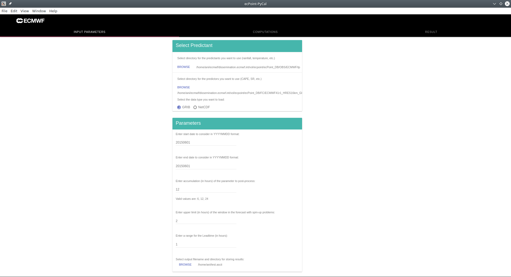
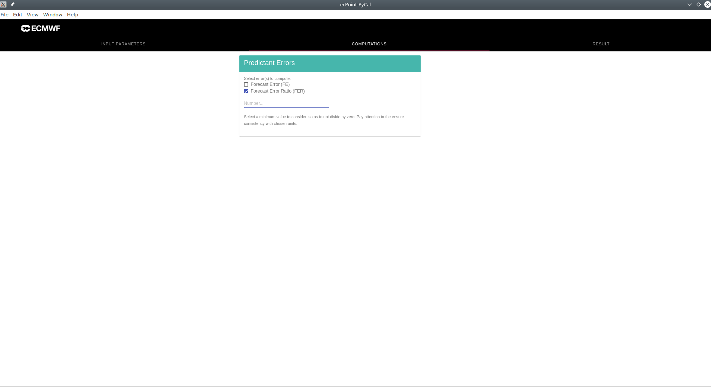

**Note:** This guide assumes that you have installed the ecPoint-PyCal package. Installation instructions can be found in the [README.md](https://github.com/onyb/reobject/blob/master/README.md) file.

#### Architectural overview

The UI for ecPoint-PyCal is powered by [Electron](https://electronjs.org). The Electron process renders the UI contents on the main window, and is responsible for spawning a child Python subprocess, and communicate with it.

We use ZeroRPC to connect to a ZeroMQ service over TCP for passing messages between the Electron process, and the Python subprocess.

 
  

#### Using the UI

##### Step 1: Select the predictors and predictants

  

##### Step 2: Select computations

  

##### Step 3: Result

TBA

**Note:** Please check the console for to track the progress of the computation. A next step would be to stream logs from the standard output to the Electron server using ZeroRPC streams.
