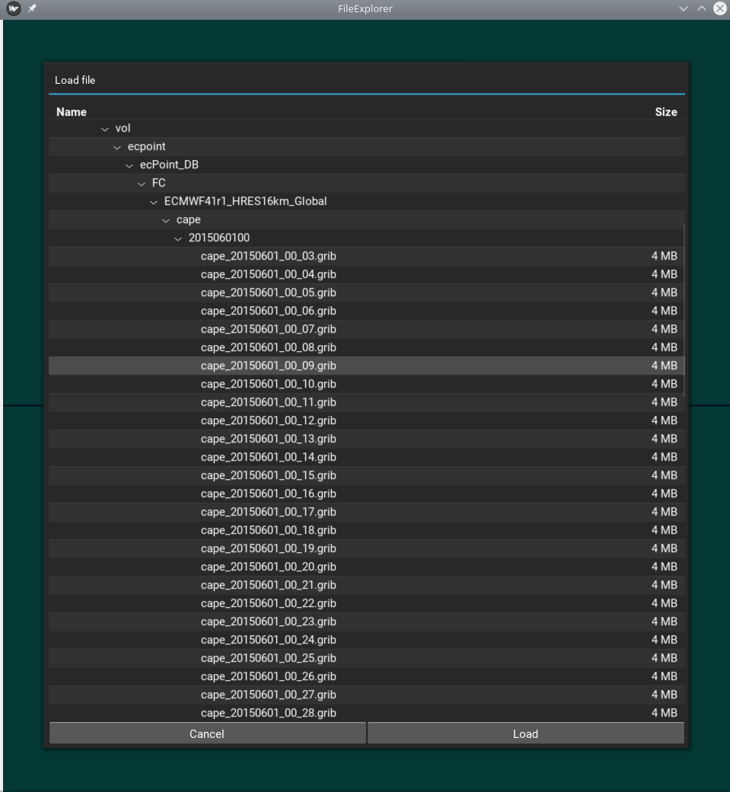

### Summary of Week 1

Spent a non-trivial amount of time figuring out how to make my development
environment reproducible. Most of my work is platform-independent, but the
full list of prerequisite packages in the README.md file is only for Ubuntu
at the moment.

Did some reading on the eccodes package, notably the Python API, and build
system.

Work on the GUI has also been started. Spent quite some time understanding
the Kivy framework.

Data loaders for GRIB and Geopoints have been implemented.

#### Build system

- A setup.py file has been implemented to automatically install project
  dependencies using pip. [[REF]](/setup.py)

- Automatically install the compile-time dependencies, notably cython and
  pygame, required by kivy. 

- Perform pre-compilation smoke tests. [[REF]](https://github.com/onyb/ecPoint-PyCal/blob/0ee8dee3dbae67954d9927cb14a349818ba4b218/setup.py#L14)

- Implement a post-installation hook to fetch eccodes source, compile, and
  install the binaries, along with the Python bindings. [[REF1]](/install_eccodes.sh) [[REF2]](https://github.com/onyb/ecPoint-PyCal/blob/0ee8dee3dbae67954d9927cb14a349818ba4b218/setup.py#L46)

#### Loaders

- Implemented an interface that all loaders should follow. [[REF]](/core/loaders/BaseLoader.py)

- Implemented GribLoader to read GRIB files. [[REF]](/core/loaders/GribLoader.py)
    * TODO: write a validator for GRIB data.
    * TODO: write unittests.

- Implemented a full-fledged GeopointsLoader to load .geo files according to
  the METVIEW standard. [[REF]](/core/loaders/GeopointsLoader.py)
    * Implemented a validator. [[REF]](https://github.com/onyb/ecPoint-PyCal/blob/0ee8dee3dbae67954d9927cb14a349818ba4b218/core/loaders/GeopointsLoader.py#L55)
    * [WIP] Implemented unittests.
    * NOTE: Some .geo files do not follow the METVIEW spec.

#### GUI

- Implemented a very basic GUI (screenshots in Appendix), using the Kivy framework. [[REF]](/uix/main.py)
- Implemented a FileSystem browser that can filter files based
  on the type of data being loaded.

### Appendix

#### GUI screenshots

